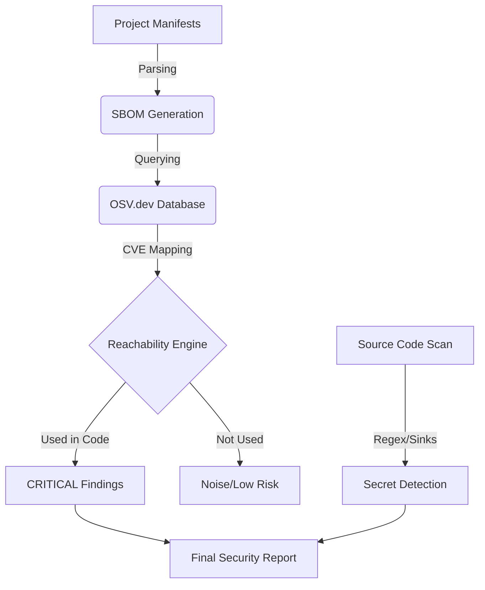

# Flux-Scanner 🛡️


**Flux-Scanner** is a sophisticated **Software Supply Chain Security** utility designed for deep security analysis. It doesn't just list vulnerabilities; it maps them against your actual code usage to determine **real risk**.

---

## 💎 Why Flux-Scanner? (The "Noise" Problem)

Most security scanners (like `pip audit` or `npm audit`) tell you when a library is vulnerable. **They don't tell you if you're actually using the vulnerable part of that library.** 

This leads to "Security Fatigue," where developers waste hours fixing vulnerabilities that couldn't possibly be exploited in their specific project. **Flux-Scanner** solves this by using **Reachability Heuristics** to filter out the noise and prioritize critical risks.

---

## ✨ Key Features

- **Reachability Heuristics**: Automatically filters out "noise" vulnerabilities that are present in your vendor folder but never actually called by your code.
- **Dynamic SBOM Generation**: Compiles a detailed Software Bill of Materials (SBOM) for Python, Node.js, Ruby, Go, Java, and Rust.
- **Deep Reconnaissance (Secrets & Sinks)**: 
  - **Secrets**: Scans for hardcoded AWS keys, Stripe tokens, and Generic API credentials.
  - **Sinks**: Identifies dangerous coding patterns (`eval()`, `os.system()`, `pickle.load()`) that could lead to Command Injection or RCE.
- **Static Asset Security**: Scans HTML files for compromised or insecure CDN-hosted script tags.
- **Vulnerability Intelligence**: Direct integration with the **OSV.dev** database for high-fidelity security data.

---

## 🛠️ Built With

This project uses modern Python development tools and security intelligence:

- **[Python 3.12](https://www.python.org/)** — Core engine and analysis logic.
- **[Typer](https://typer.tiangolo.com/)** — High-performance CLI framework.
- **[Rich](https://github.com/Textualize/rich)** — Beautiful, high-signal terminal output.
- **[Pydantic v2](https://docs.pydantic.dev/)** — Robust data validation and modeling.
- **[OSV.dev API](https://osv.dev/)** — Google's Open Source Vulnerability Database.

---

## 🧠 How It Works (The Security Pipeline)



### 📦 Phase 1: Fingerprinting (The SBOM)
Every build tool and package manager leaves a fingerprint (`package.json`, `requirements.txt`). Flux-Scanner identifies these to build an initial supply chain map.

### 🔍 Phase 2: Knowledge Mapping
Using asynchronous API calls, Flux-Scanner queries the **Open Source Vulnerabilities (OSV)** database. This provides not only CVE IDs but also **specific vulnerable function names (symbols)**.

### 🎯 Phase 3: Reachability Analysis
This is the core differentiator. Flux-Scanner performs a static analysis of your source code to see if the vulnerable symbols identified in Phase 2 are actually imported or invoked. If they aren't, the vulnerability is downgraded to "Noise."

---

## 📂 Project Structure

```text
Flux-Scanner/
├── flux_scanner/         # Core package
│   ├── main.py           # CLI entry point
│   ├── engine.py         # Reachability and Analysis Logic
│   └── styles.py         # Rich-powered terminal UI themes
├── demo-target/          # Sample vulnerable project for testing
├── pyproject.toml        # Build configuration
├── setup.sh              # Automated Linux/macOS setup script
└── requirements.txt      # Dependency list
```

---

## 🚀 Quick Start (Linux/macOS)

```bash
# Clone the repository
git clone https://github.com/VIKAS-KUMAR-10/Flux-Scanner.git
cd Flux-Scanner

# Run the automated setup
chmod +x setup.sh
./setup.sh

# Activate the environment
source .venv/bin/activate

# Scan the included demo project (v1.0.0 will find 1 reachable risk)
flux scan ./demo-target
```

---

## 📊 Sample Output (Full Analysis)

```

```

---

## 📜 Changelog
- **v1.0.0**: Initial public release. Support for Python & Node.js Reachability filters. Added OSV.dev integration.

---

## 🤝 Contributing
For internal architecture details or adding new language support, see [`DESIGN.md`](./DESIGN.md).
