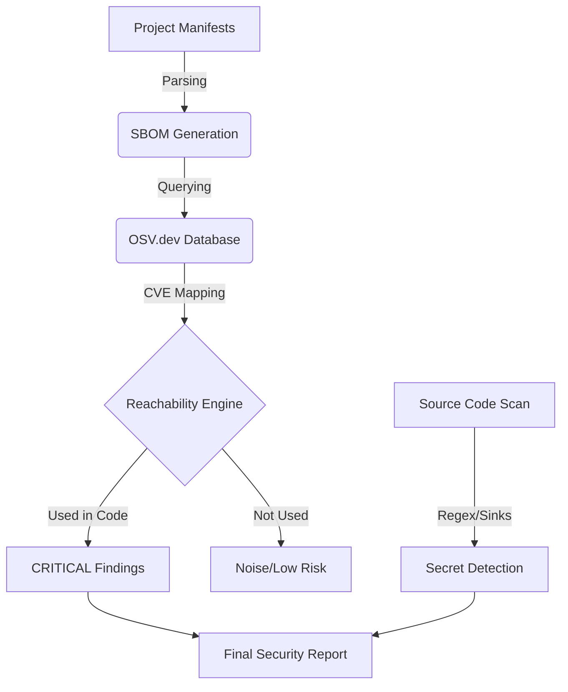

# Flux-Scanner 🛡️

**Flux-Scanner** is a sophisticated **Software Supply Chain Security** utility designed for deep security analysis. It doesn't just list vulnerabilities; it maps them against your actual code usage to determine **real risk**.

---

## ✨ Key Features

- **Language-Agnostic Engine**: Support for Python, Node.js, Ruby, Go, Java, and Rust.
- **Dynamic SBOM Generation**: Automatically compiles a detailed Software Bill of Materials.
- **Reachability Heuristics**: Automatically filters out "noise" vulnerabilities that are present in your vendor folder but never actually called by your code.
- **Vulnerability Intelligence**: Direct integration with the **OSV.dev** database for high-fidelity security data.
- **Secret & Danger Scanning**: Detects hardcoded credentials (API keys, tokens) and dangerous coding patterns (sinks).
- **Static Asset Security**: Scans HTML files for compromised or insecure CDN-hosted script tags.

---

## 🛠️ Built With

This project uses modern Python development tools and security intelligence:

- **[Python 3.12](https://www.python.org/)** — The core engine and analysis logic.
- **[Typer](https://typer.tiangolo.com/)** — A high-performance CLI framework for building user-friendly commands.
- **[Rich](https://github.com/Textualize/rich)** — A library for rendering beautiful, high-signal terminal output.
- **[Pydantic v2](https://docs.pydantic.dev/)** — Robust data validation and modeling for complex security findings.
- **[OSV.dev API](https://osv.dev/)** — Google's Open Source Vulnerability Database for real-time CVE intelligence.

---

## 🧠 How It Works (The Security Pipeline)



### 📦 SBOM (Software Bill of Materials)
The tool starts by fingerprinting your project's ecosystem. It parses files like `package.json`, `requirements.txt`, or `go.mod` to create a structured inventory of every third-party component you are using.

### 🔍 CVE Mapping & Intelligence
Every component identified in the SBOM is checked against global vulnerability databases to identify known CVEs, severity ratings, and patch versions.

### 🎯 Reachability Heuristics (The Filter)
Typical scanners produce too many "false positives." **Flux-Scanner** uses language-specific heuristics to check if the vulnerable parts of a library are actually **imported** or **invoked** in your source files. This allows security teams to focus on reachable exploits first.

---

## 🚀 Installation & Usage (Linux/macOS)

### Prerequisites
- Python 3.8+
- Git

### Setup
```bash
# Clone the repository
git clone https://github.com/VIKAS-KUMAR-10/Flux-Scanner.git
cd Flux-Scanner

# Run the automated setup script
chmod +x setup.sh
./setup.sh

# Activate the environment
source .venv/bin/activate
```

### Running a Scan
We've included a [`demo-target`](./demo-target) project that contains a vulnerable version of `lodash` so you can test the scanner immediately!

```bash
# Scan the included demo project
flux scan ./demo-target

# Scan any local project for risks
flux scan /path/to/your/project
```

---

## 📊 Sample Output (Full Analysis)

```text
[Flux-Scanner] v1.0.0 - Security & Risk Analysis Utility
Target: /home/user/my-project

Detected Ecosystems: Node.js
Analyzed Supply Chain: lodash, express, and 12 others

=== Reachable Vulnerabilities ===
[CRITICAL] | lodash (v4.17.15) | GHSA-29mw-wpgm-hmr9
  ↳ Vulnerability: Regular Expression Denial of Service (ReDoS)
  ↳ Reachable: Yes (Matched: 'import lodash from "lodash"')

=== Lower-Confidence / Noise Findings ===
[MEDIUM]   | express (v4.16.0) | GHSA-xxxx-xxxx
  ↳ Exposure: Indirect (Not imported in source)

=== Security Analysis Metrics ===
───────────────────────────────────
Total Found        : 2
Likely Reachable   : 1
Noise Filtered     : 1
-----------------------------------
Prioritization Gain: 50.0%
───────────────────────────────────
```

---

## 🤝 Contributing
Designed for extensibility. See [`DESIGN.md`](./DESIGN.md) for information on adding new language analyzers or integration feeds.
